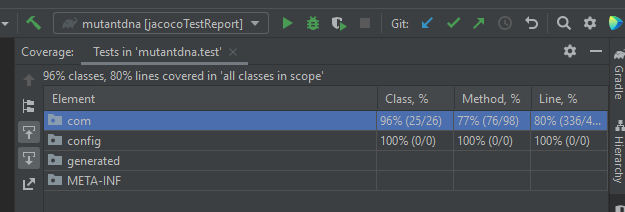

[](https://sonarcloud.io/summary/new_code?id=wilcor7190_mutantdna)
[](https://sonarcloud.io/summary/new_code?id=wilcor7190_mutantdna)
[](https://sonarcloud.io/summary/new_code?id=wilcor7190_mutantdna)

#  ADN Mutante - Mercadolibre

Prueba mercado libre.

CONTENIDO

## Ejercicio.

el ejercicio se encuentra adjunto dentro de la capeta de insumos.
[un pdf](./insumos/Examen_Mercadolibre__-_Mutantes (1).pdf)
alli describe el alcance del ejercicio.

### tecnologias usadas
- junit.
- mongoDB
- gradle
- java 11
- mockito
- log4j
- docker
- docker.hub
- azure cloud
- kubernetes
- sonarcloud

### consideraciones

para este ejercicio se penso en la optimizacion de las consultas y el recorrido de las mismas, se indago en estrategias como en las que se emplean en buscar en sopas de letras, con que fin, ya inventada la rueda solo es optimizarla, se utilizo programacion reactiva para mejorar los tiempos de rerspoesta con la libreria mono reacj.

### como usar el proyecto.

una de las opciones es contenarizar por docker.

- instale docker en el siguiente link. [Docker install](https://docs.docker.com/desktop/windows/install/)
- cuando tenga instalado docker y configurado en su maquina luego descargue la imagen de mongo de la siguiente forma:
```
docker pull mongo:4.0.4
```
-  luego descargue la imagen en la cual yo subi el proyecto de mutantes.
-  
```
docker pull wilcor7190/mutantdna:v1.0
```

- luego ejecute los contenedores empezando con mongo. este no es necesario ejecutarlo con autorizacion, no modificar el puerto ya que es el que se conecta el contenedor de mutantes.

```
docker run -d -p 27017-27019:27017-27019 -e AUTH=no --name mongodb mongo:4.0.4
```

- luego ejecute la imagen de mutantes para crear el contenedor de mutantes. la variable de entorno
  ENV representa la ip para conectarse de mutantes a la mongDB, puede ser localhost, o la IP de su maquina, la puede sacar con ipconfig

```
docker run --env ENV=192.168.1.5 -d -p 8080:8080 --name mutantservice mutantdna:v1.0
```

### API Url

para consumir los servicios se divide en dos segmentos local y de la nube.

url local mutantes
```
http://localhost:8080/mercadolibre/genetics/v1.0/mutantadn/mutants
```
url cloud  mutantes
```
http://20.94.145.113:8080/mercadolibre/genetics/v1.0/mutantadn/mutants
```
url local stast
```
http://localhost:8080/mercadolibre/genetics/v1.0/mutantadn/stats
```
url cloud  stast
```
http://20.94.145.113:8080/mercadolibre/genetics/v1.0/mutantadn/stats
```
## request adn mutante.

```
  {"dna":["ATGCGA", "CAGGGC", "TTATGT", "AGAAGG", "CCCCTA", "TCACTG"]}
```

Response adn mutante:

```
  200 OK
```
Request adn negativo:

```
  {"dna":["AATACT", "CCCAGA", "GGGATT", "AATTCC", "GGATCG", "TCACTG"]}
```

Response adn negativo:

```
  403 Forbidden
  {"codigo":403,"mensaje":"El resultado de ADN mutante de la prueba es: Negativa"}
```


## Conteo de Adn

Response conteo de adn:

```
  200 OK
```

```
{
    count_mutant_dna: 4,
    count_human_dna: 1,
    ratio: 0.8
}
```

## test

para los test se uso mockito.

## cobertura

para la cobertura se supero el 80%




